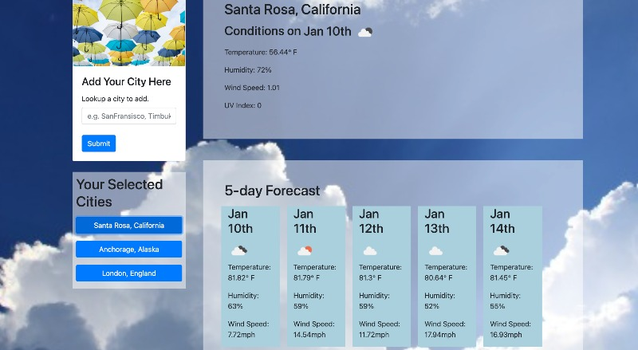

# weather-app
Current weather conditions and a 5-day forecast for your saved cities!

#### Jump to: 
* [Description](#description)
* [Link](#link)
* [Methods](#methods)
* [Author](#author)


## Description

Use this interactive weather app to get current weather conditions for any city on earth. It will also show you a convenient 5-day forecast for planning. Your searches are saved so that you can easily toggle back and forth between cities you have looked up. 

<br><br>



<br><br>


## Link

[Customized Weather App](https://laurendarrimon.github.io/weather-app/)


## Built With

* [Javascript](https://www.w3schools.com/js/)
* [HTML](https://www.w3schools.com/html/default.asp)
* [CSS](https://www.w3schools.com/w3css/defaulT.asp)


## Methods 

### Bootstrap

Using Bootstrap for the grid layout and basic styling elements.  

### Open Weather API

This weather app utilizes the data from [Open Weather](https://openweathermap.org/api) to generate the weather. Three APIs were used:

1. Geocoding API to get the geographic coordinates of the search city
2. One Call API to get current weather & UV index
3. 5 Day/ 3 Hour Forecast API for 5 day Forecast


### Moment.js

This weather app utilizes the moment.js library to translate the UNIX time geberated buy the Open Weather API into human readable dates. 

### JQuery & AJAX

The JQuery javascript library was used to simplify DOM traversal, event listeners and API calls. This applictaion utilizes the .ajax method to call the Open Weather API. Here you can see an example of the API call and saving the repsonse into an object with weather details. You can also see moment.js utilized to reformat the Unix time into a day and month. 

```
    $.ajax({   
        url: currentWeatherURL,
        method: 'GET',
    }).then(function (response) {

        weatherDate = moment(response.current.dt, "X").format("MMM Do");

        currentWeatherInfo["city"] = cityStateName;   
        currentWeatherInfo["date"] = weatherDate;
        currentWeatherInfo["icon"] = response.current.weather[0].icon;
        currentWeatherInfo["temp"] = response.current.temp
        currentWeatherInfo["humidity"] = response.current.humidity
        currentWeatherInfo["wind"] = response.current.wind_speed;
        currentWeatherInfo["uv"] = response.current.uvi;

        displayCurrentWeather();
    });

```


## Author

### Lauren Duker Darrimon 

- [Link to Portfolio Site](https://www.laurenlalita.com)
- [Link to Github](https://github.com/LaurenDarrimon)
- [Link to LinkedIn](https://www.linkedin.com/in/lauren-lalita-duker-9537b1201/)

## License
[MIT Open Source Software](/LICENSE.txt)